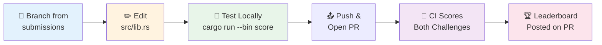
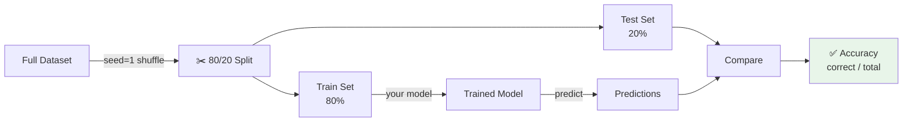
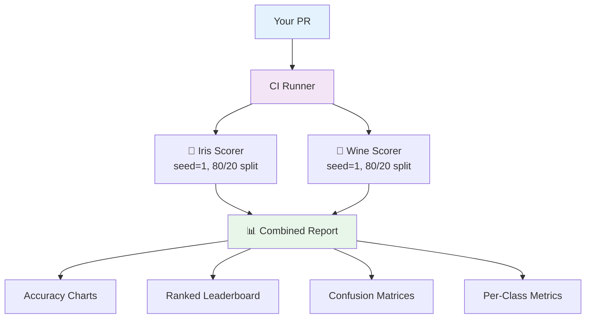

# ML Leaderboard Rules

## Two Challenges

| Challenge | Dataset | Samples | Features | Classes | Baseline | Difficulty |
|-----------|---------|---------|----------|---------|----------|------------|
| **Iris** | `linfa_datasets::iris()` | 150 | 4 | 3 (flower species) | 93.3% | Easy |
| **Wine Quality** | `linfa_datasets::winequality()` | 1599 | 11 | 6 (quality scores 3-8) | 53.9% | Hard |

Both challenges are scored on every PR. Edit the corresponding functions in `src/lib.rs`.

## How to Submit

1. Create a branch from `submissions`
2. Edit `src/lib.rs` -- modify the functions for one or both challenges
3. Run `cargo run --bin score --release` (Iris) and/or `cargo run --bin score_wine --release` (Wine) locally
4. Open a PR targeting the `submissions` branch
5. CI will score both challenges and post a combined leaderboard

## What to Change

Only modify these functions in `src/lib.rs`:

**Iris (Easy):**
- **`build_and_predict(train, test_features)`** -- Train your Iris model and return predictions
- **`model_name()`** -- Name your Iris model

**Wine Quality (Hard):**
- **`build_and_predict_wine(train, test_features)`** -- Train your wine quality model and return predictions
- **`model_name_wine()`** -- Name your wine model

## Allowed

- Any `linfa-*` crate (trees, SVM, KNN, linear, logistic, etc.)
- Any algorithm, any hyperparameters
- Feature engineering using `ndarray` operations
- Adding new `linfa-*` dependencies to `Cargo.toml`

## Not Allowed

- Modifying the scorers (`src/bin/score.rs`, `src/bin/score_wine.rs`)
- Hardcoding predictions
- Using non-linfa ML crates
- Changing the random seed or split ratio

## Scoring

- Fixed random seed: `1`
- Train/test split: 80/20
- Metric: accuracy = correct predictions / total test samples
- Deterministic -- same code always gets the same score

## What You Get on Your PR

CI posts a detailed performance report as a comment on your PR:

- **Two leaderboard sections** -- Iris and Wine Quality scored independently
- **Accuracy comparison charts** -- Mermaid bar charts for each challenge
- **Ranked leaderboards** -- standings across all open submissions
- **Confusion matrices** -- shows which classes your model confuses
- **Per-class metrics** -- precision, recall, and F1 score per class

When your PR is merged, the unified [LEADERBOARD.md](LEADERBOARD.md) on the `submissions` branch is updated automatically.

## Quick-Start Vibe Prompts

Try giving these prompts to your AI coding assistant:

### Iris

> "Change the model in src/lib.rs to use KNN with k=5 instead of a decision tree. Use linfa-nn."

> "Switch to a random forest approach -- train multiple decision trees with different depths and take a majority vote."

### Wine Quality (Hard Mode)

> "For the wine model in src/lib.rs, try linfa-svm with an RBF kernel -- wine quality has overlapping classes that need a non-linear decision boundary."

> "The wine dataset is imbalanced. Normalize the features before training and try a deeper decision tree with max_depth=20."

> "Build an ensemble for the wine model -- train 5 decision trees with different depths and max_depth settings, then use majority voting."
