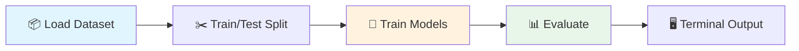
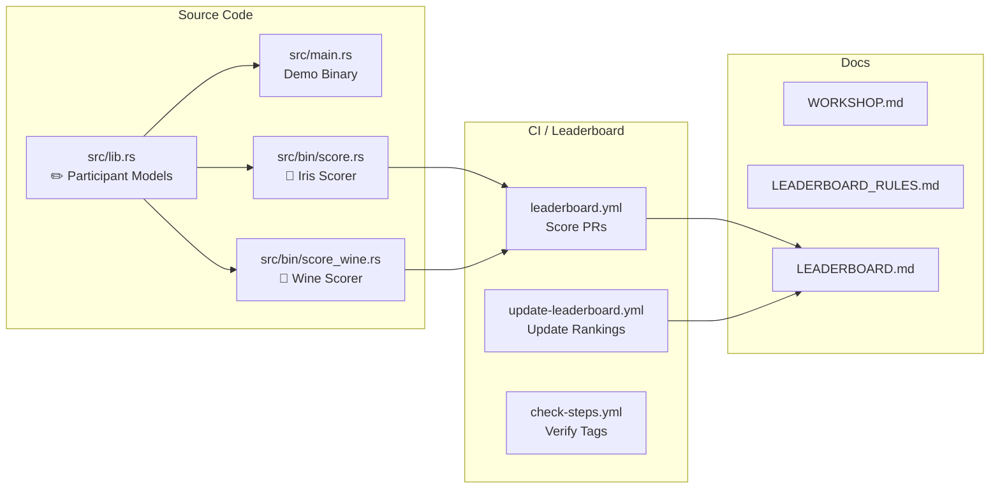
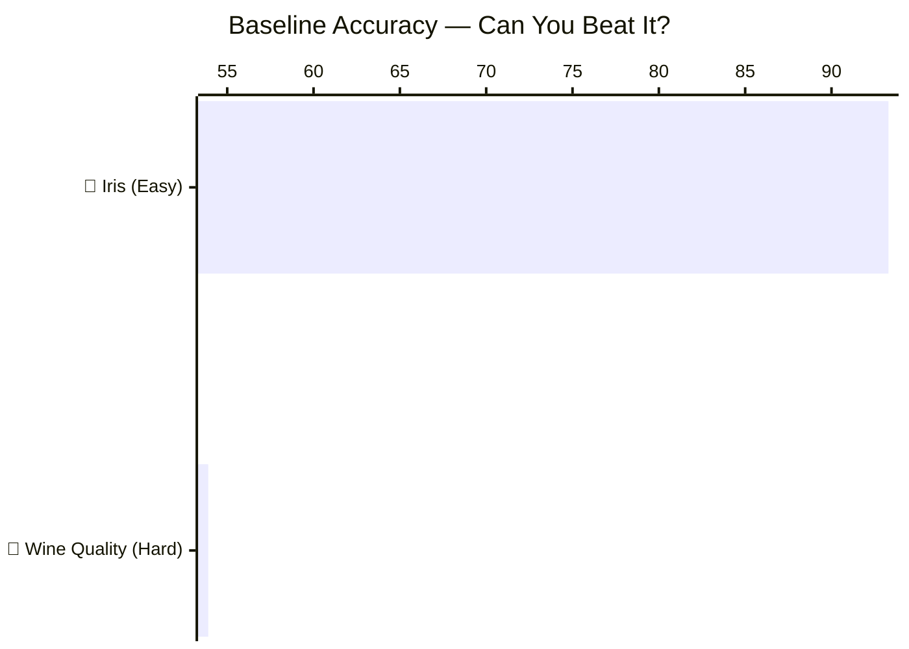

# Vibe Coding a Rust ML Pipeline

A workshop demo project that builds an Iris flower classifier in Rust using [Linfa](https://github.com/rust-ml/linfa), demonstrating the "vibe coding" workflow -- where AI assistants handle syntax while you focus on intent, and the Rust compiler acts as your safety net.

## What It Does



- Loads the classic Iris dataset (150 samples, 4 features, 3 classes)
- Trains two Decision Tree classifiers (participant model from lib.rs + built-in Entropy tree)
- Evaluates both models and displays results in formatted terminal tables

## Prerequisites

- **Rust toolchain** (1.93+ stable): [Install via rustup](https://rustup.rs/)
- **Git** (to navigate workshop checkpoints)

## Quick Start

```bash
git clone https://github.com/Tony363/vibe-rust-ml-workshop.git
cd vibe-rust-ml-workshop
cargo run --release
```

## Workshop Steps

The project is built incrementally. Each Git tag represents a compilable, runnable checkpoint:


### Step 1: Scaffold (`step-1-scaffold`)

```bash
git checkout step-1-scaffold
cargo run
# Output: "Vibe Rust ML Workshop"
```

Minimal project setup with dependencies in `Cargo.toml`: linfa, linfa-trees, linfa-datasets, ndarray, comfy-table, rand.

### Step 2: Data Loading (`step-2-data`)

```bash
git checkout step-2-data
cargo run
```

Loads Iris dataset via `linfa_datasets::iris()`, displays a dataset info table, and splits 80/20 for training/testing.

### Step 3: Model Training (`step-3-training`)

```bash
git checkout step-3-training
cargo run
```

Trains two Decision Tree classifiers:
- **Tree 1** (lib.rs): Entropy, max depth = 10
- **Tree 2** (main.rs): Entropy, unlimited depth

### Step 4: Evaluation + Pretty Output (`step-4-complete`)

```bash
git checkout step-4-complete
cargo run --release
```

Full pipeline with predictions, accuracy comparison, confusion matrix, and sample predictions table.

To return to the final version:
```bash
git checkout master
```

## Expected Output

```
  Vibe Rust ML Workshop -- Iris Classification

┌───────────────┬──────────────────────────────────────────────────────┐
│ Property      ┆ Value                                                │
╞═══════════════╪══════════════════════════════════════════════════════╡
│ Dataset       ┆ Iris                                                 │
├╌╌╌╌╌╌╌╌╌╌╌╌╌╌╌┼╌╌╌╌╌╌╌╌╌╌╌╌╌╌╌╌╌╌╌╌╌╌╌╌╌╌╌╌╌╌╌╌╌╌╌╌╌╌╌╌╌╌╌╌╌╌╌╌╌╌╌╌╌╌┤
│ Samples       ┆ 150                                                  │
├╌╌╌╌╌╌╌╌╌╌╌╌╌╌╌┼╌╌╌╌╌╌╌╌╌╌╌╌╌╌╌╌╌╌╌╌╌╌╌╌╌╌╌╌╌╌╌╌╌╌╌╌╌╌╌╌╌╌╌╌╌╌╌╌╌╌╌╌╌╌┤
│ Features      ┆ 4                                                    │
├╌╌╌╌╌╌╌╌╌╌╌╌╌╌╌┼╌╌╌╌╌╌╌╌╌╌╌╌╌╌╌╌╌╌╌╌╌╌╌╌╌╌╌╌╌╌╌╌╌╌╌╌╌╌╌╌╌╌╌╌╌╌╌╌╌╌╌╌╌╌┤
│ Classes       ┆ 3 (Setosa, Versicolor, Virginica)                    │
├╌╌╌╌╌╌╌╌╌╌╌╌╌╌╌┼╌╌╌╌╌╌╌╌╌╌╌╌╌╌╌╌╌╌╌╌╌╌╌╌╌╌╌╌╌╌╌╌╌╌╌╌╌╌╌╌╌╌╌╌╌╌╌╌╌╌╌╌╌╌┤
│ Feature Names ┆ sepal length, sepal width, petal length, petal width │
└───────────────┴──────────────────────────────────────────────────────┘

  Train/Test split: 120 training, 30 testing samples

  Training Model 1: DecisionTree (Entropy, depth=10)...
  -> Trained in ~130µs
  Training Model 2: Decision Tree (Entropy, unlimited depth)...
  -> Trained in ~150µs

  Model Comparison
┌──────────────────────────────────┬───────────────┬───────────┬──────────┬────────────┐
│ Model                            ┆ Split Quality ┆ Max Depth ┆ Accuracy ┆ Train Time │
╞══════════════════════════════════╪═══════════════╪═══════════╪══════════╪════════════╡
│ DecisionTree (Entropy, depth=10) ┆ -             ┆ -         ┆ ~93-100% ┆ ~130µs     │
├╌╌╌╌╌╌╌╌╌╌╌╌╌╌╌╌╌╌╌╌╌╌╌╌╌╌╌╌╌╌╌╌╌╌┼╌╌╌╌╌╌╌╌╌╌╌╌╌╌╌┼╌╌╌╌╌╌╌╌╌╌╌┼╌╌╌╌╌╌╌╌╌╌┼╌╌╌╌╌╌╌╌╌╌╌╌┤
│ Tree 2                           ┆ Entropy       ┆ None      ┆ ~93-100% ┆ ~150µs     │
└──────────────────────────────────┴───────────────┴───────────┴──────────┴────────────┘

  Confusion Matrix (DecisionTree (Entropy, depth=10))
┌────────────────────┬────────┬────────────┬───────────┐
│ Actual \ Predicted ┆ Setosa ┆ Versicolor ┆ Virginica │
╞════════════════════╪════════╪════════════╪═══════════╡
│ Setosa             ┆ ~10    ┆ 0          ┆ 0         │
├╌╌╌╌╌╌╌╌╌╌╌╌╌╌╌╌╌╌╌╌┼╌╌╌╌╌╌╌╌┼╌╌╌╌╌╌╌╌╌╌╌╌┼╌╌╌╌╌╌╌╌╌╌╌┤
│ Versicolor         ┆ 0      ┆ ~10        ┆ 0-1       │
├╌╌╌╌╌╌╌╌╌╌╌╌╌╌╌╌╌╌╌╌┼╌╌╌╌╌╌╌╌┼╌╌╌╌╌╌╌╌╌╌╌╌┼╌╌╌╌╌╌╌╌╌╌╌┤
│ Virginica          ┆ 0      ┆ 0-1        ┆ ~10       │
└────────────────────┴────────┴────────────┴───────────┘

  Sample Predictions (first 10 test samples)
┌────┬─────────┬─────────┬─────────┬─────────┬────────────┬────────────┐
│ #  ┆ Sepal L ┆ Sepal W ┆ Petal L ┆ Petal W ┆ Actual     ┆ Predicted  │
╞════╪═════════╪═════════╪═════════╪═════════╪════════════╪════════════╡
│ 1  ┆ 5.0     ┆ 3.4     ┆ 1.5     ┆ 0.2     ┆ Setosa     ┆ Setosa     │
├╌╌╌╌┼╌╌╌╌╌╌╌╌╌┼╌╌╌╌╌╌╌╌╌┼╌╌╌╌╌╌╌╌╌┼╌╌╌╌╌╌╌╌╌┼╌╌╌╌╌╌╌╌╌╌╌╌┼╌╌╌╌╌╌╌╌╌╌╌╌┤
│ 2  ┆ 6.8     ┆ 3.2     ┆ 5.9     ┆ 2.3     ┆ Virginica  ┆ Virginica  │
├╌╌╌╌┼╌╌╌╌╌╌╌╌╌┼╌╌╌╌╌╌╌╌╌┼╌╌╌╌╌╌╌╌╌┼╌╌╌╌╌╌╌╌╌┼╌╌╌╌╌╌╌╌╌╌╌╌┼╌╌╌╌╌╌╌╌╌╌╌╌┤
│ .. ┆ ...     ┆ ...     ┆ ...     ┆ ...     ┆ ...        ┆ ...        │
├╌╌╌╌┼╌╌╌╌╌╌╌╌╌┼╌╌╌╌╌╌╌╌╌┼╌╌╌╌╌╌╌╌╌┼╌╌╌╌╌╌╌╌╌┼╌╌╌╌╌╌╌╌╌╌╌╌┼╌╌╌╌╌╌╌╌╌╌╌╌┤
│ 10 ┆ 6.9     ┆ 3.1     ┆ 5.4     ┆ 2.1     ┆ Virginica  ┆ Virginica  │
└────┴─────────┴─────────┴─────────┴─────────┴────────────┴────────────┘
```

Note: the demo uses seed 42; the CI scorer (`src/bin/score.rs`) uses seed 1 for fair leaderboard comparison.

## Project Structure



## Dependencies

| Crate | Purpose |
|-------|---------|
| [linfa](https://crates.io/crates/linfa) | ML framework (scikit-learn for Rust) |
| [linfa-trees](https://crates.io/crates/linfa-trees) | Decision Tree classifier |
| [linfa-datasets](https://crates.io/crates/linfa-datasets) | Built-in datasets (Iris, Wine Quality) |
| [ndarray](https://crates.io/crates/ndarray) | N-dimensional arrays |
| [comfy-table](https://crates.io/crates/comfy-table) | Pretty terminal tables |
| [rand](https://crates.io/crates/rand) | Random number generation (shuffling) |

## Workshop Challenge

Think you can beat the baseline? Two challenges, pick one or both!



| Challenge | Dataset | Baseline | Beat this! |
|-----------|---------|----------|------------|
| **Iris (Easy)** | 150 samples, 4 features, 3 classes | 93.3% | Can you hit 100%? |
| **Wine Quality (Hard)** | 1599 samples, 11 features, 6 classes | 53.9% | Can you break 65%? |

### Quick Start

```bash
git checkout submissions
git checkout -b my-submission
# edit src/lib.rs -- change build_and_predict() and/or build_and_predict_wine()
cargo run --bin score --release       # check Iris score locally
cargo run --bin score_wine --release  # check Wine Quality score locally
git add -A && git commit -m "my submission"
git push -u origin my-submission
# open a PR targeting the 'submissions' branch
```

### Rules

- Only modify `src/lib.rs` and `Cargo.toml`
- Must use linfa algorithms
- CI scores both challenges with a fixed seed for fairness
- CI will automatically post a combined leaderboard on your PR

See [LEADERBOARD.md](LEADERBOARD.md) for current standings and [LEADERBOARD_RULES.md](LEADERBOARD_RULES.md) for full rules.

## Resources

- [Linfa Documentation](https://docs.rs/linfa/latest/linfa/)
- [Linfa GitHub](https://github.com/rust-ml/linfa) -- scikit-learn-like ML in Rust
- [Burn](https://github.com/tracel-ai/burn) -- Deep learning framework for Rust
- [Candle](https://github.com/huggingface/candle) -- Hugging Face's minimalist ML framework for Rust
- [Are We Learning Yet?](https://www.arewelearningyet.com/) -- Rust ML ecosystem tracker

## License

MIT
